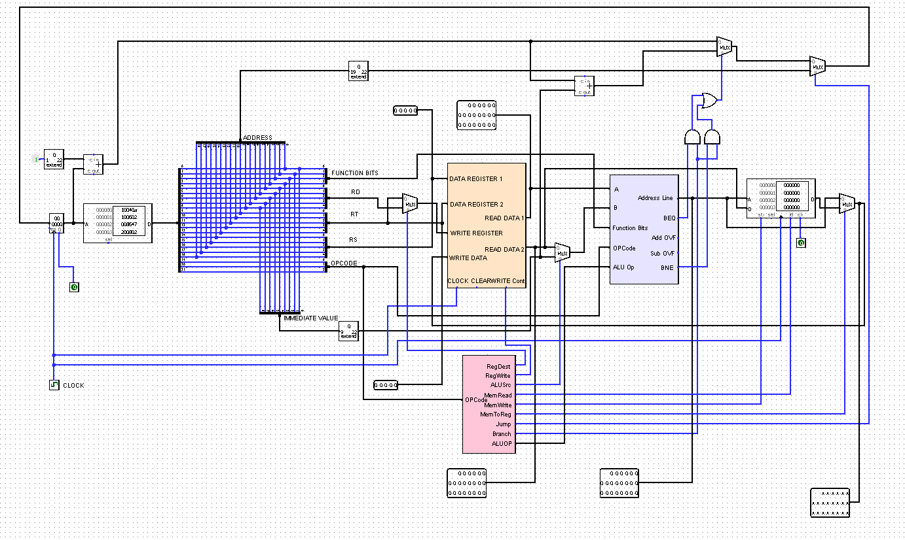
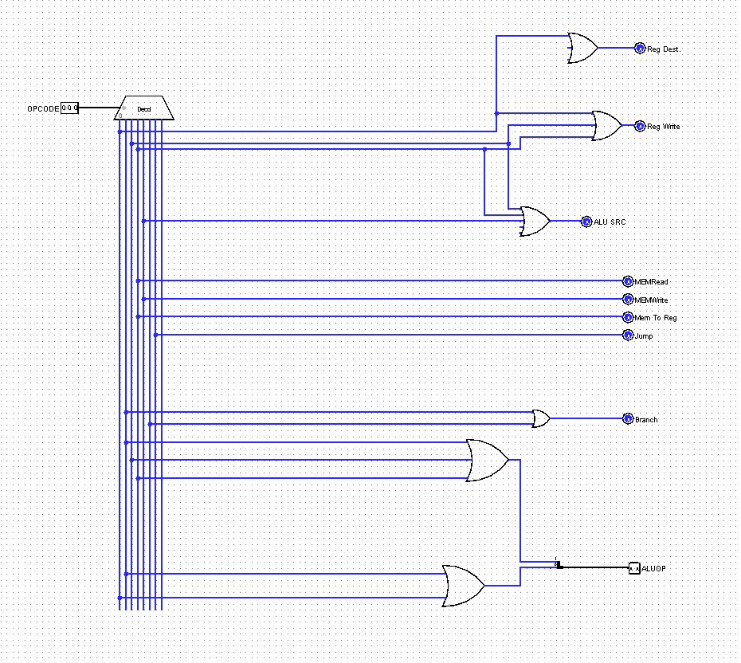
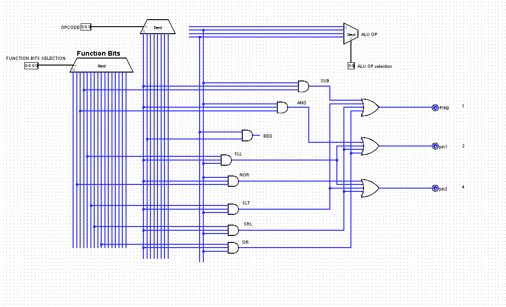

# 22-bit MIPS Datapath (Logisim) + Python Assembler

A custom **22-bit MIPS-like single-cycle CPU datapath** built in **Logisim**, including a **control unit**, **ALU**, and **register file**, plus a **Python assembler** that generates **Logisim-compatible ROM initialization (`v2.0 raw`)** files.

> Course project (CSE 332 — Computer Organization and Architecture).

---

## Overview

This repository contains a Logisim implementation of a **22-bit CPU datapath** inspired by MIPS-style design principles (register file → ALU → memory/branch/jump → write-back), along with a small Python assembler that converts a simplified assembly program into a ROM image that can be loaded into Logisim.

---

## Features

- **22-bit single-cycle datapath** implemented in Logisim
- Modular subcircuits (ALU, Register File, Control Unit, ALU Control)
- Supports a simplified **22-bit instruction encoding** (R/I/J formats)
- **Python assembler** that emits Logisim ROM image format (`v2.0 raw`)
- Example input program and generated output ROM image

---

## Tech Stack

- **Logisim / Logisim-evolution** (circuit design and simulation)
- **Python 3** (assembler)

---

## Screenshots

### Main top-level integration


### 22-bit MIPS Datapath


### 22-bit ALU


### 22-bit Register File


### Control Unit


### ALU Control



---

## Folder Structure

Recommended structure:

```text
22-bit-mips-datapath-logisim/
├─ circuits/
│  └─ FINAL_PROJECT_1.circ
├─ assembler/
│  ├─ assembler.py
│  └─ README.md
├─ examples/
│  ├─ inputs.txt
│  └─ outputs.raw
├─ assets/
│  └─ screenshots/
│     ├─ MAIN.png
│     ├─ 22 BIT MIPS DATAPATH.png
│     ├─ 22 BIT ALU.png
│     ├─ 22 BIT REGISTER.png
│     ├─ CONTROL UNIT.png
│     └─ ALU CONTROL.png
├─ .gitignore
├─ LICENSE
└─ README.md
```

## Instruction Set / Encoding (22-bit)

The design uses a compact 22-bit instruction format.

### R-type (22 bits)

```text
[ opcode:3 ][ rs:5 ][ rt:5 ][ rd:5 ][ funct:4 ]
```
### I-type (22 bits)
```text
[ opcode:3 ][ rs:5 ][ rd:5 ][ imm:9 ]
```
### J-type (22 bits)
```text
[ opcode:3 ][ target:19 ]
```

## Opcodes and Function Bits (from assembler)

Ensure these mappings match the Logisim control logic. If you modify control wiring, update the assembler mapping accordingly.

### Opcodes

- `000`: R-type group (`add`, `sub`, `and`, `or`, `nor`, `sll`, `srl`, `slt`, `nop`)
- `001`: `beq`
- `010`: `addi`
- `011`: `lw`
- `100`: `sw`
- `101`: `bne`
- `110`: `j`

### Function bits (R-type)

- `0000`: `nop`
- `0001`: `nor`
- `0010`: `and`
- `0011`: `sub`
- `0100`: `sll`
- `0101`: `slt`
- `0110`: `srl`
- `0111`: `add`
- `1000`: `or`


## Setup / Installation

### 1) Open the circuit in Logisim

1. Install **Logisim** or **Logisim-evolution**.
2. Open the project file:

```text
circuits/FINAL_PROJECT_1.circ
```

### 2) Python requirements (assembler)
- Python 3.x installed (no external dependencies assumed)


## Usage

### Assemble a program (generate ROM image)

The assembler converts an input assembly file (example: `examples/inputs.txt`) into a Logisim ROM image (example: `examples/outputs.raw`).

Typical run (from repository root):  
```text
python3 assembler/assembler.py
```

**Notes:**
- Current script behavior may assume specific filenames/paths (depending on how it was written for the course workflow).
- Recommended: keep an example pair in `examples/` and document how to reproduce it.

---

### Load the ROM image in Logisim

1. Open `circuits/FINAL_PROJECT_1.circ`.
2. Navigate to the datapath/main circuit (e.g., the CPU top-level).
3. Select the instruction ROM/RAM component.
4. Use **Load Image** (or equivalent) and load: 
```text
examples/outputs.raw
```
5. Step the clock to execute instructions.


## Configuration

No `.env` required.

If you add CLI flags later (recommended), document them here. Example:  
Run the assembler with input/output path arguments (TBD — only if you implement this).

---

## Tests

TBD.

Recommended test additions:
- Golden assembler outputs for known input programs
- Step-by-step CPU state expectations (register values after N cycles) for a few demo programs

---

## Troubleshooting

- **ROM image won’t load:** Verify the output file starts with `v2.0 raw` and contains valid hex words.
- **Wrong behavior in simulation:** Confirm the opcode/function-bit mapping in Logisim matches the assembler’s mapping.
- **Immediate issues:** If negative immediates are used, verify whether the assembler implements two’s complement and whether the datapath expects signed/unsigned immediates (TBD based on your design).


## Roadmap

- [ ] Add CLI arguments: `--in`, `--out`
- [ ] Add label support (`loop:`, `beq label`, `j label`)
- [ ] Add strict validation (register bounds, immediate range, opcode/funct coverage)
- [ ] Add automated tests for assembler output
- [ ] Add demo programs (arith, branch, memory, loop) with expected results

---

## Contributing

Contributions are welcome:
- improvements to assembler robustness and usability,
- better documentation of control signals and datapath behavior,
- example programs and regression tests.

Open an issue or PR with a clear description of the change and how it was tested.

---

## License
MIT

---

## Acknowledgements

- CSE 332 — Computer Organization and Architecture 
- Logisim tooling used for circuit design and simulation
- Special thanks to [TimeWithPotato](https://github.com/TimeWithPotato)

---

## Contact

- **Author:** [Motasim Abid](https://github.com/MotasimAbid19) — Motasimabid19@gmail.com  
- **2nd Author:** [Naima Zaman Roshni](https://github.com/NaimaRoshni) — naima.zaman@northsouth.edu
